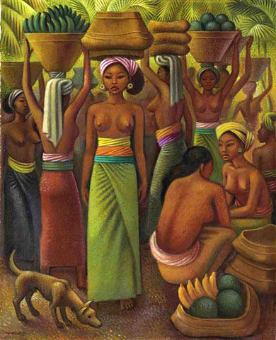
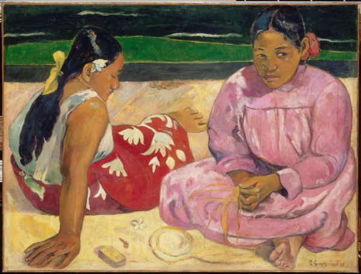
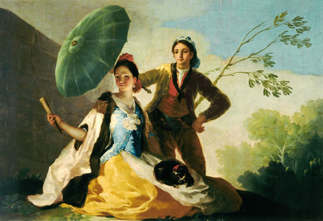
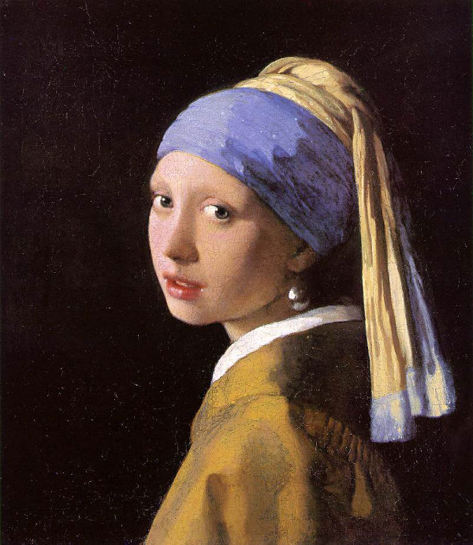

# Miguel Covarrubias, "Offering of Fruits for the Temple" (huile sur toile, 1932)

Miguel Covarrubias (22 novembre 1904, Mexico - 4 février 1957) est un peintre, caricaturiste mexicain, mais également un ethnologue et historien de l'art autodidacte.

Peint au cours de sa lune de miel à Bali, ce tableau empreint de fantaisie montre des jeunes femmes à demi-nues, à la peau mordorée et portant des jupes rouge et vert citron et des paniers de fruits triangulaires au sommet de leurs têtes.

De gauche à droite : #879100, #b57100, #9c4d1f, #542e20, #f2f2f2

La palette résultante est harmonieuse et majoritairement chaude, avec une pointe de vert pour amener de la fraîcheur.  
Elle pourrait ainsi très bien convenir à un site orienté "vacances", "voyages"…

# Paul Gauguin, "Femmes de Tahiti - Sur la plage" (huile sur toile, 1891)

Paul Gauguin (7 juin 1848, Paris -- 8 mai 1903, Îles Marquises) est un peintre post-impressionniste considéré comme l'un des peintres français majeurs du XIXe siècle.

En 1891, peu après son arrivée à Tahiti suite à l'abandon de sa famille et de son travail, Paul Gauguin y découvrit l'art primitif et ses à-plats de couleurs franches inspirées d'une nature sauvage, et le retranscrit avec candeur dans une série de toiles dont celle-ci est la plus connue.

De gauche à droite : #a03e38, #e3da95, #4e5549, #1f2c27, #a57f7a

Mélant les couleurs désaturées du sable, de l'herbe et de la robe rose d'une des protagonistes et le rouge vif de la jupe de l'autre, cette palette, à la fois contemporaine et sophistiquée, conviendra par exemple à un site _corporate_ (banque, cabinet d'avocats, etc.).

# Francisco José de Goya, "El Parasol" (huile sur toile, 1777)

Francisco José de Goya, (30 mars 1746, Fuendetodos -- 16 avril 1828, Bordeaux) est un peintre et graveur espagnol.

En 1773, Goya épouse la sœur de Francisco Bayeu, peintre de chambre du roi, et s'installe à Madrid. 
Pour la Manufacture royale de tapisseries, il exécute alors de nombreux cartons où sont peintes les distractions de la jeunesse madrilène et destinés aux palais royaux (activité qu'il poursuivra pendant près de vingt ans), comme celui-ci réalisé en 1777.

De gauche à droite : #97b3a8, #6f8927, #edecaf, #b68b00, #a54a2a

La palette inspirée par cette toile est d'une grande fraîcheur et très délicate, et pourrait ainsi convenir à un site présentant un service innovant ou une application (web ou autre).

# Vassily Kandinsky, "Einige Kreise" (huile sur toile, 1928)

Vassily Kandinsky (Décembre 1866, Moscou -- 13 décembre 1944, Neuilly-sur-Seine) est un peintre russe et un théoricien de l’art considéré comme l’un des artistes les plus importants du XXe siècle et comme le fondateur de l'art abstrait.

Cette toile, dont le titre veut dire "Quelques cercles" et qui a été peinte pendant l'époque où Kandinsky donnait des cours dans le cadre de l’atelier de peinture murale du [Bauhaus](http://fr.wikipedia.org/wiki/Bauhaus), est représentative de ses travaux sur l’étude des formes, qui reprennent sa théorie des couleurs en y intégrant de nouveaux éléments sur la psychologie de la forme.

De gauche à droite : #97dca6, #151e27, #2c00c7, #5b9ff8, #bac0f6

Seules l'aura colorée autour du cercle principal et les teintes des cercles plus petits amènent la lumière. Le fond moiré presque noir (égal au silence selon Kandinsky) accentue l’effet de froideur des bleus majoritairement présents.  
Comme la toile dont elle est inspirée, cette palette est donc très puissante et conviendra mieux à un site à vocation artistique ou culturelle (présentation d'un artiste, d'une troupe, etc.).

# Jan Vermeer, "Meisje met de Parel" (huile sur toile, 1666)

Jan Vermeer (31 octobre 1632, Delft -- 15 décembre 1675, Delft) est un peintre baroque néerlandais parmi les plus célèbres du Siècle d’or bien que sa carrière ait été relativement courte et son œuvre de faible ampleur.

Cette toile, aussi appelée "Joconde du Nord" et dont l'origine reste encore aujourd'hui mystérieuse, met en scène les deux couleurs de prédilection de Vermeer : le bleu et le jaune citron, éclairés par la blancheur de la perle, des yeux et du col de la jeune fille, et fortement contrastés par le fond très sombre pour un effet général en presque à-plats très moderne (contrastant déjà avec le style précis et léché des peintres contemporains).

De gauche à droite : #d1a67f, #ecd68c, #b6b6dc, #8781c4, #241519

Cette palette est toute en délicatesse et clarté, pour un effet aérien, sobre et pourtant très "habillé". Le marron presque noir tiré du fond du tableau vient apporter un point de concentration et de contraste.
Plus versatile, cette palette pourrait être appliquée à une assez grande variété de typologies de site, comme par exemple un site éditorial/rédactionnel.

# Conclusion

Les palettes que nous vous proposons ici ne sont que des exemples de ce qu'il est possible de déduire de chacunes de ces toiles, et c'est aussi l'intérêt de la démarche. L'exercice aurait ainsi pu être (et sera ?) réalisé avec des supports très différents ou plus "modernes" : pochettes de CD, peintures digitales, affiches de films, oeuvres architecturales, etc.  
La conclusion principale à en tirer, c'est que l'inspiration est partout, et particulièrement dans l'œil de celui qui observe.

Vous voilà donc parés, à vos outils graphiques (Photoshop, Gimp, Kuler...) !